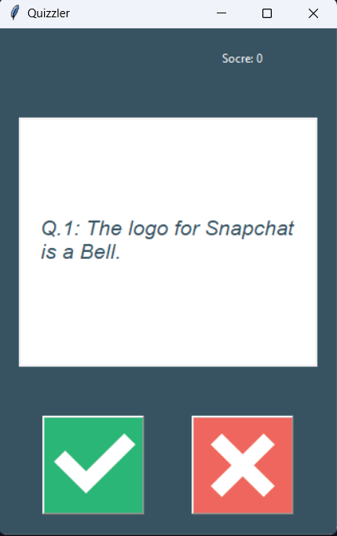
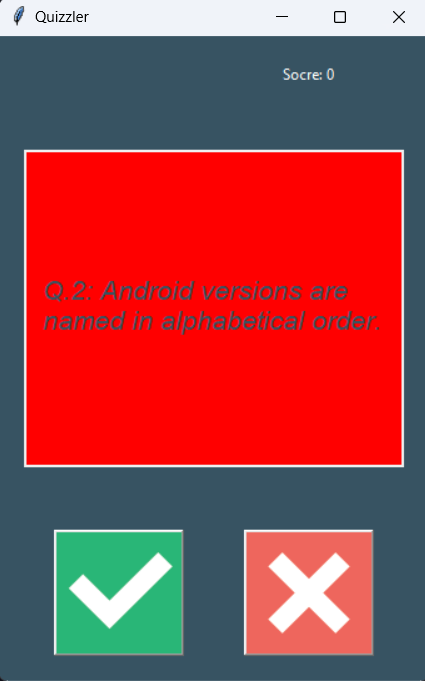
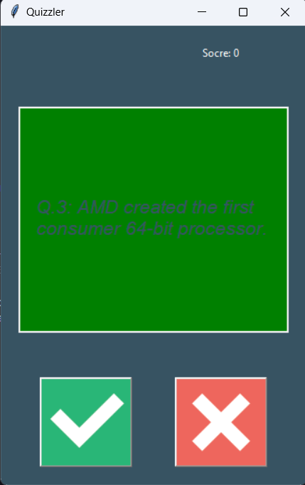
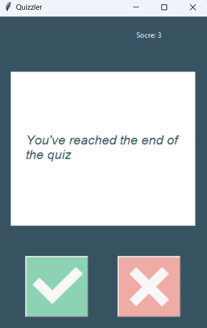

# Day 34: Quizzler - Quiz Application

## Overview

The Quizzler Quiz Application is a True/False quiz game that presents a series of questions fetched from the Open Trivia Database API. The app features a graphical user interface (GUI) built using Tkinter. It allows users to test their knowledge across various topics while keeping track of their score.

This project is part of the **100 Days of Code: The Complete Python Pro Bootcamp** by Angela Yu.

## Features

- **Dynamic Question Fetching**: The app fetches random questions from the Open Trivia Database API.
- **True/False Questions**: All questions are in a True/False format.
- **Score Tracking**: The app tracks the user's score as they progress through the quiz.
- **Interactive GUI**: The application uses Tkinter to display questions and capture user responses.

## How the Application Works

1. **Data Fetching**: 
   - The application uses the `requests` library to retrieve 10 random True/False questions from the Open Trivia Database API. 
   - The questions are filtered by category (in this case, category 18: Science: Computers).

2. **Quiz Logic**:
   - The `QuizBrain` class manages the flow of the quiz by keeping track of the current question, checking answers, and calculating the score.
   - The questions are displayed one by one on the GUI, and the user selects either `True` or `False`.

3. **User Interface**:
   - The `QuizInterface` class uses Tkinter to display the current question and the score.
   - After each question, the interface provides feedback by changing the background color to green (correct) or red (incorrect).
   - The quiz ends when there are no more questions left, and the buttons are disabled.

## Project Structure

- **`data.py`**: Handles fetching data from the Open Trivia Database API.
- **`question_model.py`**: Defines the `Question` class, which stores the question text and correct answer.
- **`quiz_brain.py`**: Manages the quiz logic such as tracking the score, retrieving the next question, and checking the user's answer.
- **`ui.py`**: Manages the graphical interface using Tkinter, displaying questions and allowing user input.
- **`main.py`**: Entry point of the application, initializing the quiz, UI, and starting the game loop.

## How to Run the Project

1. Clone this repository to your local machine:
   ```bash
   git clone https://github.com/marina6coneto/100_days_of_code_python.git
   ```

2. Navigate to the `day_34` directory:
   ```bash
   cd 100_days_of_code_python/day_34
   ```

3. Ensure Python is installed on your machine.

4. Install the necessary dependencies (e.g., `requests` and Tkinter):
   ```bash
   pip install requests
   ```

5. Run the `main.py` file:
   ```bash
   python main.py
   ```

## Example

When you start the application, a window will appear displaying the first question. You can select either `True` or `False` by clicking the corresponding button. After answering, you will see whether your answer was correct, and the score will update accordingly.

Once the quiz ends, a message will be displayed, and the buttons will be disabled.

## Technologies Used

- Python
- Tkinter for the graphical user interface (GUI)
- Requests for handling API requests

## Acknowledgements

This project is developed as part of the **100 Days of Code: The Complete Python Pro Bootcamp** by Angela Yu.

## Screenshots

**Initial Screen**  


**Incorrect Answer**  


**Correct Answer**  


**Quiz Ended**  


