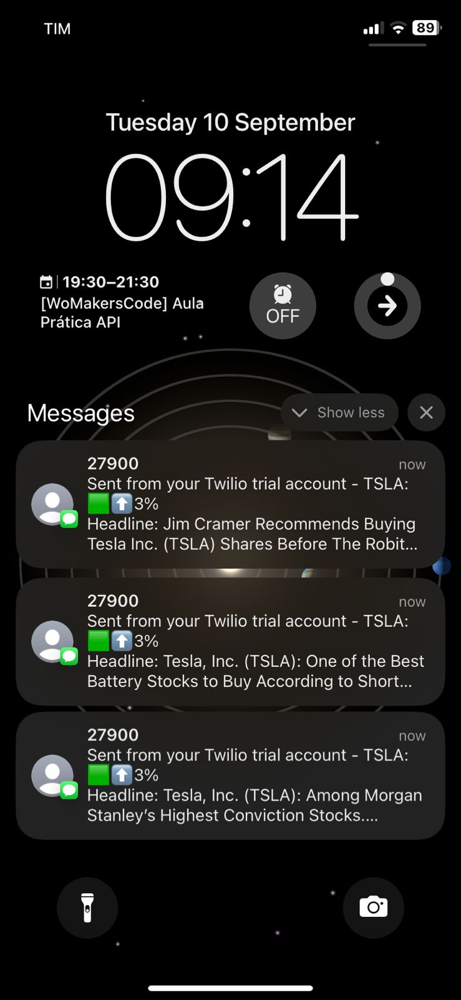
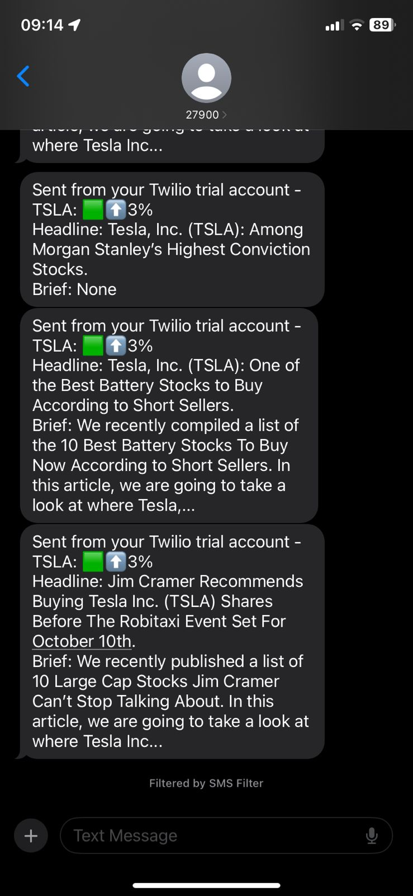

# Day 36: Stock Price and News Alert Application

This Python application tracks the stock price of Tesla Inc. (TSLA) and sends SMS alerts when there is a significant price change. If the price difference exceeds 1%, the app also fetches relevant news articles and sends them via SMS.
This project is part of the **100 Days of Code: The Complete Python Pro Bootcamp** by Angela Yu.

## Features
- Retrieves daily stock data for Tesla Inc. (TSLA) from Alpha Vantage API.
- Compares the last two days' closing prices.
- Calculates the percentage difference in stock price.
- Fetches relevant news articles about Tesla from the News API.
- Sends an SMS alert with the price change and news headlines using the Twilio API.

## Requirements
- Python 3.x
- Twilio account and API credentials.
- Alpha Vantage API key.
- News API key.

## How to Set Up and Run the Project

1. Clone the repository and navigate to the project directory.
   ```bash
   git clone <repository_url>
   cd <project_directory>
   ```

2. Install the required dependencies:
   ```bash
   pip install requests twilio
   ```

3. Set up environment variables for your API keys and authentication tokens:
   - `STOCK_API_KEY`: Your Alpha Vantage API key.
   - `NEWS_API_KEY`: Your News API key.
   - `TWILIO_SID`: Your Twilio account SID.
   - `TWILIO_AUTH_TOKEN`: Your Twilio Auth Token.
   - `TWILIO_PHONE`: Your Twilio phone number.
   - `YOUR_PHONE`: Your real phone number to receive the alerts.

4. Run the Python script:
   ```bash
   python stock_news_alert.py
   ```

## Important Notes
- Make sure to keep your API keys and authentication tokens safe and secure. Do not expose them in public repositories.
- The script checks for stock price changes and sends SMS alerts only if the percentage change exceeds 1%.

## Example Output
- SMS alert message:
   ```
   TSLA: 🟩⬆️ 2%
   Headline: Tesla Launches New Model.
   Brief: Tesla's new model is receiving widespread praise in the EV market.
   ```
# Stock Price and News Alert Application



---


