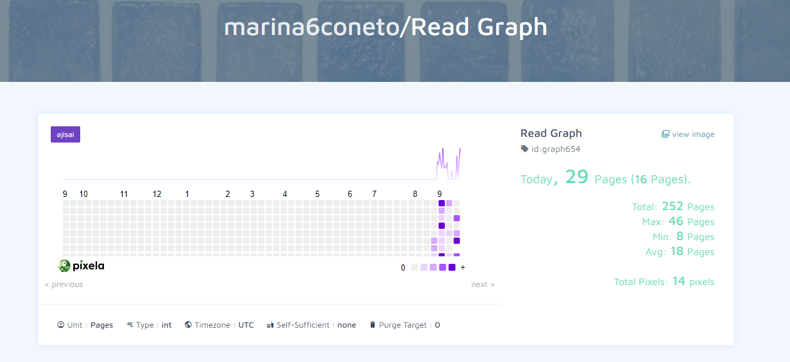

# Day 37: Pixel Reading Tracker

- This project tracks the number of pages you read every day using the Pixela API.
- It allows you to create a graph that visually represents your reading habits over time, update your progress, and delete any incorrect entries.
- This project is part of the **100 Days of Code: The Complete Python Pro Bootcamp** by Angela Yu.

## Read Graph




## Project Overview

This Python script uses the Pixela API to interact with your personal graph for tracking daily reading progress. The program performs the following tasks:
- Creates a new user on the Pixela platform.
- Sets up a graph to track the number of pages read.
- Logs your daily reading by creating pixels (data points).
- Updates existing entries if needed.
- Deletes specific entries if required.

## Setup

- To get started, you need to create an account on [Pixela](https://pixe.la/).
- After signing up, you'll receive a unique token that you'll use to interact with the API.
- Then, follow the steps below to configure the script.

### Requirements

- Python 3.x
- `requests` library

You can install the required library using the following command:

```bash
pip install requests
```

### Configuration

Replace the placeholders in the script with your own Pixela information:

```python
USERNAME = 'YOURUSERNAME'
TOKEN = 'YOURTOKEN'
GRAPH_ID = 'YOURGRAPHID'
```

- `USERNAME`: Your Pixela username.
- `TOKEN`: Your Pixela token (keep it secure).
- `GRAPH_ID`: A unique ID to identify your graph.

## How to Run the Project

1. Clone this repository or download the script.
2. Make sure you have Python 3.x installed on your machine.
3. Install the required dependencies by running `pip install requests`.
4. Replace the placeholder values with your Pixela account details.
5. Run the script:
   ```bash
   python pixel_reading_tracker.py
   ```
6. Follow the prompt to log your daily reading progress.

## Features

- **Create Graph**: Set up a custom graph to track your reading progress.
- **Log Reading**: Input the number of pages read each day.
- **Update Entries**: Modify any past entries if needed.
- **Delete Entries**: Remove incorrect data entries.

## Additional Information

Pixela allows you to visualize your habits and daily progress in various aspects of life, not just reading. Check out their [documentation](https://docs.pixe.la/) for more information on how to customize and extend this project.

